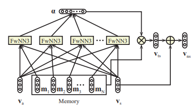
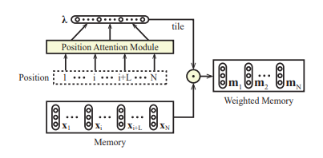

# Ontology based Deep Learning for ABSA

> Aspect Based Sentiment Analysis, PyTorch Implementations.
>
>
  

The aim of this research is to extend deep learning models with information coming from domain ontologies to improve their working especially when small amounts of annotated data are available. Ontologies can play a role in the feature formation of deep learning solutions or can inject knowledge in the appropriate components of the used deep learning network architecture. 

The work here uses the framework and some of the implementations developed by [songyouwei](https://github.com/songyouwei/ABSA-PyTorch) as a starting point.

## New models

### BaseA ([base_a.py](./models/base_a.py))
Content attention module
- Attention weight of memory slices is calculated using a FwNN with 2 inputs. This differes from memnet that uses concatenation

<a href="https://www.codecogs.com/eqnedit.php?latex=&hash;&space;scores&space;=&space;W_1&space;*&space;tanh(W2*m_i&space;&plus;&space;W_3*v_a&space;&plus;&space;b_1)" target="_blank"></a>


### BaseB ([base_b.py](./models/base_b.py))
Sentence-level content attention module
- Adds the sentence representation to the calculation of the attention weight
- Embedds the entire sentence into the output vector resulting of attn_applied



### BaseC ([base_c.py](./models/base_c.py))
Position attention based memory module *words arround the aspect have a greater impact on the sentiment polarity*
- The memory is weighted by the position attention weights
- The weighted memory is feed into the sentence-level content attention module



### Extensions
Ontologies

## Implemented models

### RAM ([ram.py](./models/ram.py))
Chen, Peng, et al. "Recurrent Attention Network on Memory for Aspect Sentiment Analysis." Proceedings of the 2017 Conference on Empirical Methods in Natural Language Processing. 2017. [[pdf]](http://www.aclweb.org/anthology/D17-1047)


### MemNet ([memnet.py](./models/memnet.py))
Tang, Duyu, B. Qin, and T. Liu. "Aspect Level Sentiment Classification with Deep Memory Network." Conference on Empirical Methods in Natural Language Processing 2016:214-224. [[pdf]](https://arxiv.org/pdf/1605.08900)


### IAN ([ian.py](./models/ian.py))
Ma, Dehong, et al. "Interactive Attention Networks for Aspect-Level Sentiment Classification." arXiv preprint arXiv:1709.00893 (2017). [[pdf]](https://arxiv.org/pdf/1709.00893)


### TD-LSTM ([td_lstm.py](./models/td_lstm.py))

Tang, Duyu, et al. "Effective LSTMs for Target-Dependent Sentiment Classification." Proceedings of COLING 2016, the 26th International Conference on Computational Linguistics: Technical Papers. 2016. [[pdf]](https://arxiv.org/pdf/1512.01100)


### LSTM ([lstm.py](./models/lstm.py))


## Requirement

* PyTorch 0.4.0
* NumPy 1.13.3
* tensorboardX 1.2
* Python 3.6
* GloVe pre-trained word vectors (See `data_utils.py` for more detail)
  * Download pre-trained word vectors [here](https://github.com/stanfordnlp/GloVe#download-pre-trained-word-vectors),
  * extract the [glove.twitter.27B.zip](http://nlp.stanford.edu/data/wordvecs/glove.twitter.27B.zip) and [glove.42B.300d.zip](http://nlp.stanford.edu/data/wordvecs/glove.42B.300d.zip) to the root directory

## Usage

### Training

```sh
python train.py --model_name ian --dataset twitter --logdir ian_logs
```

### See the training process (needs to install TensorFlow)

```sh
tensorboard --logdir=./ian_logs
```


## Reviews / Surveys

Zhang, Lei, Shuai Wang, and Bing Liu. "Deep Learning for Sentiment Analysis: A Survey." arXiv preprint arXiv:1801.07883 (2018). [[pdf]](https://arxiv.org/pdf/1801.07883)

Young, Tom, et al. "Recent trends in deep learning based natural language processing." arXiv preprint arXiv:1708.02709 (2017). [[pdf]](https://arxiv.org/pdf/1708.02709)

## Contributions

Feel free to contribute!

You can raise an issue or submit a pull request, whichever is more convenient for you.

## Licence

MIT License
